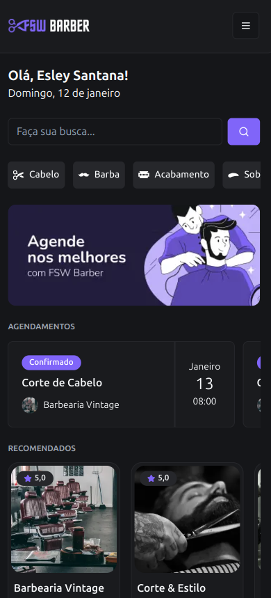
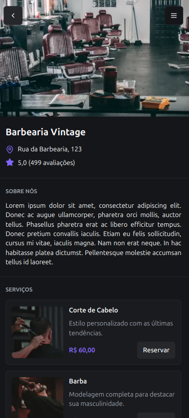
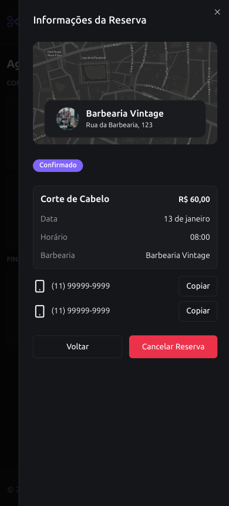
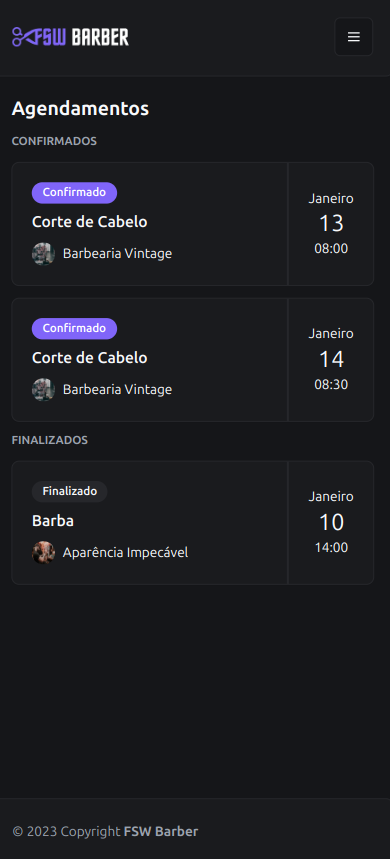

# **FSW Barber**

Este projeto foi desenvolvido durante o curso **_Full Stack Club_**, sob a mentoria de **Felipe Rocha**, com o objetivo de criar um sistema de **agendamento de serviços** para barbearias. O foco foi aplicar **boas práticas de desenvolvimento**, utilizando tecnologias **modernas** e **escaláveis**, tanto no **_frontend_** quanto no **_backend_**.

---

## 🚀 **Tecnologias Usadas**

### **Frontend**
- **Next.js**: Framework React para construção de **interfaces modernas**.
- **React**: Biblioteca JavaScript para criação de **interfaces de usuário**.
- **TypeScript**: Para **tipagem estática** e maior **robustez** no desenvolvimento.
- **TailwindCSS**: Estilização **rápida** e **eficiente**.
- **ShadCN**: Biblioteca para criação de **componentes acessíveis**.

### **Backend**
- **PostgreSQL**: Banco de dados **relacional robusto**.
- **NeonDB**: Serviço em nuvem para **hospedagem** do banco de dados.
- **Prisma**: ORM para **integração** e **manipulação de dados**.

### **Outras Ferramentas e Bibliotecas**
- **DateFNS**: Para **manipulação e formatação de datas**.
- **Husky**: Automação de tarefas no controle de versão com **Git**.
- **Lint-Staged**: Garantia de **qualidade de código** antes dos commits.
- **Zod**: Validação de dados e **formulários dinâmicos**.

---

## ⚙️ **Funcionalidades**

- **📅 Agendamento de Serviços**: Sistema completo para **gestão de horários e serviços**.
- **✅ Validação de Dados**: **Formulários** com feedback em **tempo real**.
- **📱 Interface Responsiva**: Design **adaptado** para diferentes **tamanhos de tela**.

---

## 🎯 **Objetivos**

- Praticar e consolidar conhecimentos em **_desenvolvimento full stack_**.
- Criar uma **aplicação real** utilizando **Next.js** e **Prisma**.
- Implementar **boas práticas** como validação de dados e automação de processos.
- Hospedar a aplicação em um ambiente produtivo utilizando **NeonDB**.

---

## 🖼 **Layout do Projeto**

### **Tela Inicial**

### **Informações da barbearia**

### **Informações do agendamento**

### **Página de Agendamento**

---

**💡 Aprendizado:** Este projeto foi **fundamental** para consolidar habilidades no **desenvolvimento full stack**, desde a **construção de interfaces modernas** até a **integração com banco de dados** e **deploy em produção**.

**📬 Conecte-se comigo:**
[**LinkedIn**](https://www.linkedin.com/in/esley-santana-521780325/)